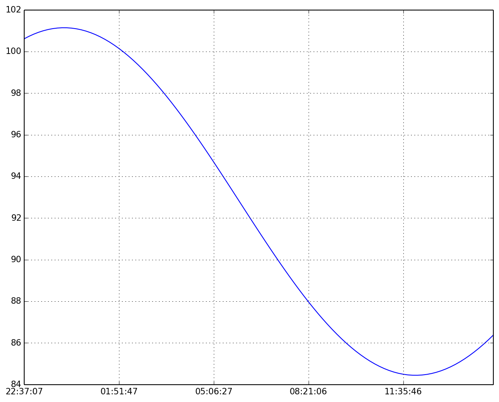
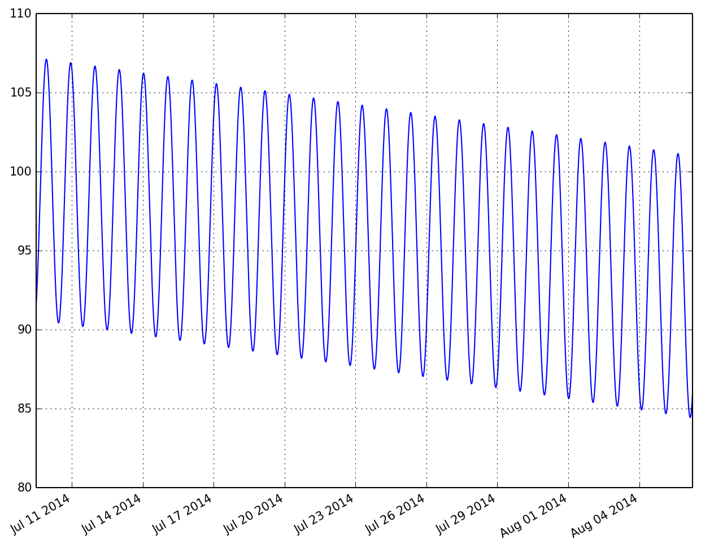

# The sun is back!

### Disclaimer
I wrote this blog post 2 weeks ago, but I wanted to show the IPython notebook in its full glory, 
so I got delayed posting this until I finally had finished my Blogger blog transition to a static website 
blogging system that supports the display of IPython notebooks. 
So, the excitement that hopefully still transpires, is not as fresh, but nonetheless: 
*Mars is right now producing fans every day somewhere!* 
I updated all times below to have more relevant data to show.

## Intro
I realised today that we are so close to the official beginning of Martian southern spring, I wondered if the sun already is up over Inca City. Here is how I go about finding out what's currently going on there, using tools that I have written over the years.

First I make my main library for this, `kmaspice`, available to me.


```
from pymars import kmaspice
```

Now I will create an object that knows how to deal with Martian times and illuminations.


```
inca = kmaspice.MarsSpicer()
```

I saved some predefined places and their locations into the code, so that I don't need to remember the coordinates all the time. So let's justify the variable name by actually setting it on top of Inca City:
<!-- TEASER_END -->


```
inca.goto('inca')
```

By default, when I don't provide a time, the time is set to the current time. In the UTC timezone, that is:


```
inca.time.isoformat()
```


    '2014-08-05T13:47:44.441759'


To double-check how close we are to spring time in the southern hemisphere on Mars, I need to look at a value called $L_s$ (L sub s), which is the solar longitude.

This value measures the time of the seasons on Mars as its angular position during its trip around the sun. And southern spring was defined to be at $L_s = 180^\circ$.


```
round(inca.l_s, 1)
```


    173.2


So, we are pretty close to spring then. But do we already have sunlight in Inca? We should remember that we are in polar areas, where we have darkness for half a year, just like on Earth. Let's have a look what is the local time in Inca:


```
inca.local_soltime
```


    (22, 27, 23, '22:27:23', '10:27:23 P.M.')


(The output provides me with 3 different formats for the same, just in case I need that)

Right, that's in the night, so that most likely means that the sun is below the horizon, right?

Solar angles are measured from the local normal direction, with the sun directly over head being defined as 0. Which means the horizon is at 90 degrees. 

I am calling up on a value with the name `dsolar` which is my shortcut for solar angle in degrees.


```
round(inca.illum_angles.dsolar, 1)
```


    100.5


So, this value of 100 means the sun is below the horizon. But it is local night, so we would expect that!

Now comes the magic, let's just advance the time by a couple of hours, usually the sun is highest around local noon, so let's aim for that. I don't need to be precise now, so I go just 14 hours forward in time.
Then I will have another look at the sun's angle.


```
inca.advance_time_by(14*3600)
round(inca.illum_angles.dsolar)
```


    84.0


Oh yes! This is just 6 degrees above the horizon, the sun is lurking over it just a tiny bit. But all you people that work so hard in helping us out know what this means, right? 
**Where there is sun, there is energy.** 
And this energy can be used to sublime CO2 gas and create the wonderful fans we are studying.
Let's make this a bit prettier with a bit more insight. First, let's go back the 14 hours again.


```
inca.advance_time_by(-14*3600)
```

Now, I will create a loop with 100 elements, and check and write down the time each 10 minutes (= 600 seconds). 
I save the resulting numbers in 2 new arrays to have it easier to plot things over time later.


```
times = []
angles = []

for i in range(100):
    inca.advance_time_by(600)
    times.append(inca.local_soltime[3])
    angles.append(inca.illum_angles.dsolar)
```

I'm now importing the pandas library, an amazing toolbox to deal with time-series data. Especially, the plots automatically get nicely formatted time-axes, which is always a pain with plotting.


```
import pandas as pd
```


```
data = pd.Series(angles, index=times)
```

I need to switch this notebook to show plots inside this notebook and not outside as an extra window, which is my default:


```
%pylab inline
```

    Populating the interactive namespace from numpy and matplotlib


```
data.plot()
```


    <matplotlib.axes.AxesSubplot at 0x115ac1e90>





Here we see how the sun's angle is developing over time. As expected we see a minimum (i.e. highest sun over horizon) right around noon. 
###Do you hear the CO2 ice crackling?? ;) 
I find it amazing to know that in approx. 8 hours some of our beloved fans are being created!

Next I wondered how long we already have the sun lurking over the horizon. For this I now will go backwards in 10 minute steps, but this time I take 4000 steps to cover more time. I then immediately plot the results:


```
times = []
angles = []

for i in range(4000):
    inca.advance_time_by(-600)
    times.append(inca.time)
    angles.append(inca.illum_angles.dsolar)
pd.Series(angles,index=times).plot()
```


    <matplotlib.axes.AxesSubplot at 0x1162d1590>





Interesting! Now we can see that around July 14th, the sun for the first time was below an inclination angle of 90, meaning that's the first day of this season when it lurked over the horizon. 

So for 3 weeks now, the available energy is slowly building up CO2 gas underneath the CO2 ice cover that is everywhere. I could bet that at some place with weak thin ice, already the first fans are popping up. Unfortunately, the light conditions at local times of 2-4 PM, when our favorite camera HiRISE is flying over these places, were still so bad then, that we did not plan any images at that time.

But from now on it's possible and we have indeed new observations planned. And YOU can choose which one the HiRISE team will focus on get ready for public release, just vote here: http://www.planetfour.org/vote/

